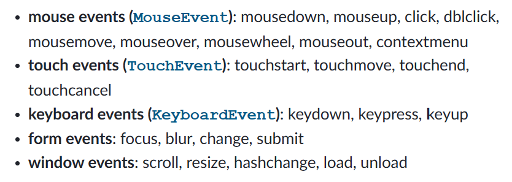

# JavaScript
### <span style="color:#0d6efd">How do you define a function in JS?</span>
---
We can use the function keyword followed by function name with a list of parameters to function, enclosed in parentheses and separated by commas. The javascript statements that define the function, enclosed in curly braces.

```
function functionName(arguments){
    javascript statements
}
```
--- 
### <span style="color:#0d6efd">How do you create an object from class in JS?</span>
---
**Using the new keyword** This is the most common way to create an object from a class. The new keyword creates a new instance of the class and assigns it to a variable. For example, the following code creates a new instance of the Person class and assigns it to the person variable. For example consider a person class using new key word we can create new instance of the person class

```
class Person {
    constructor(name, age){
        this.name = name;
        this.age = age;
    }
}

const person = new Person("Ganesh", 23);
```
**Using the Object.create() method** The Object.create() method creates a new object that inherits from the prototype of the object you pass to it as an argument. For example, the following code creates a new object that inherits from the Person class prototype:

```
class personPrototype {
    constructor(name, age){
        this.name = name;
        this.age = age;
    }
}

const person = Object.create(personPrototype);
```
---

### <span style="color:#0d6efd">How do you declare a string variable in JS?</span>
---
We can simply use **let**, **var** and **const** these keywords followed by variable name equal to Double quotation mark.

```
let variableName = "";
```
Or as objects, using **String()** constructor.

```
const variableName = new String("Hello this is string object");
```
in nut shell --> Strings can be created as primitives, from string literals, or as objects, using the **String()** constructor:

---

### <span style="color:#0d6efd">Which keyword is used to declare block-scoped variable in ES6?</span>
---
**let** allows variables to be re-assigned, making it suitable for situations where you need to change the value of a variable within a block of code.
```
let x = 1;
if(x==1){
    let y = 2;
    console.log(y); 
}
console.log(y); //Reference Error: y is not declared
```
In this example, the variable y is declared with the let keyword, so it is only accessible within the if block. When we try to access y outside of the if block, we get a ReferenceError.

let is a great way to improve the readability and maintainability of your code. It helps to avoid errors by preventing variables from being accessed from outside of the scope where they are declared.

---
### <span style="color:#0d6efd">what is the purpose of the ... operator in ES6?</span>
---
The **...** operator used to speared the array elements. **It can be used to copy an array, merge arrays, or add elements to an array.** 

---
### <span style="color:#0d6efd">Which keyword is used to refer to current instance of class inside its method?</span>
---

**this** keyword is used to refer current instance of the class.

```
class Great {
    constructor(name){
        this.name = name;
    }

    great(){
        return `Hello ${this.name}`
    }
}
```
In the above example, the **this** keyword is used to access the name instance variable in the greet() method. The this keyword is also used to invoke the greet() method on the current instance of the Person class. 

---
### <span style="color:#0d6efd">How do you add an event listener to a HTML element in JS?</span>
---
To add an event listener to a HTML element in JS, you can use the addEventListener() method. The addEventListener() method takes two parameters: the type of event to listen for and the function to run when the event occurs.
For example, to add a click event listener to a button, you would use the following code:
```
const button = document.getElementById("idOfElement");
button.addEventListener(event, function);
```
**Different Types of Events**

[](./images/eventListenerTypes.png)

---

### <span style="color:#0d6efd">how to check a variable is array or not in javascript?</span>

---
```
let array = [1];
console.log(Array.isArray(array)); //it will return true
```
in above example isArray() method used to check whether the variable is array or not.
if the method return true then it is array.
if not it is not a array.

---

## Important Topics of JS

1. Spread operator
2. map(), reduce(), flitter() functions
3. Array methods
4. String methods
5. objects and it's methods
6. Different types of functions
7. Why JS functions are first class citizens?
